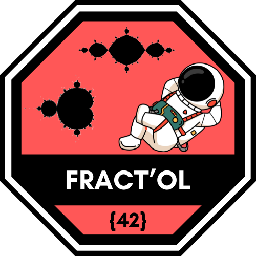

# 42 Cursus Badges

Este README muestra las imágenes de los badges obtenidos en el curso 42 y a qué círculo pertenecen.

| Círculo       | Proyecto        | Badge                                                        |
| :------------ | :-------------- | :-----------------------------------------------------------: |
| 0             | Common Core     |        |
| 0             | Libft           |                    |
| 1             | Born2beroot     |        |
| 1             | ft_printf       |            |
| 1             | Get Next Line   |    |
| 2             | Exam Rank 02    |      |
| 2             | Fract-ol        |                |
| 2             | Pipex           |                    |
| 2             | Push Swap       |            |

## Nota
Solo se muestran los badges de los proyectos completados sin bonus.
